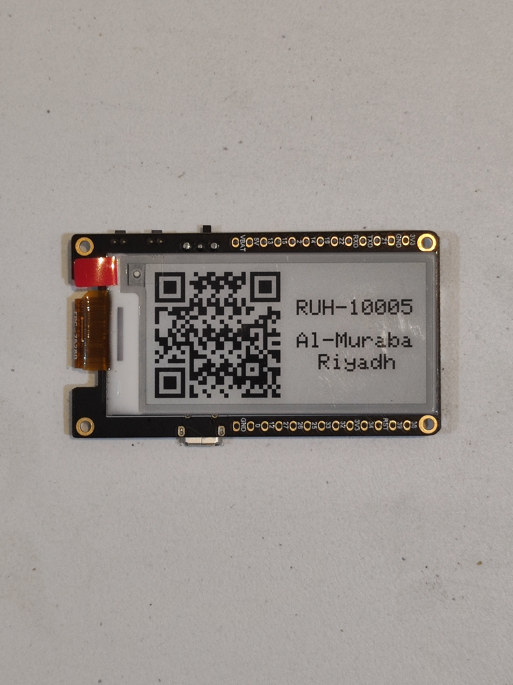

# QR-code-generation-in-ePaper-esp32-board-for-Smart-Locker

## using an esp32 board equipped with an epaper display to show a QR code and information for a smart locker(Parcel box)

  
"Front picture of the board with QR code and Information displayed"

"Back picture of the board"

